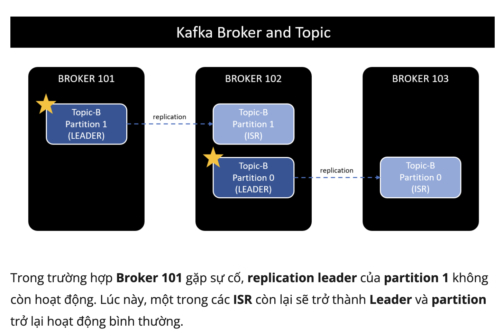
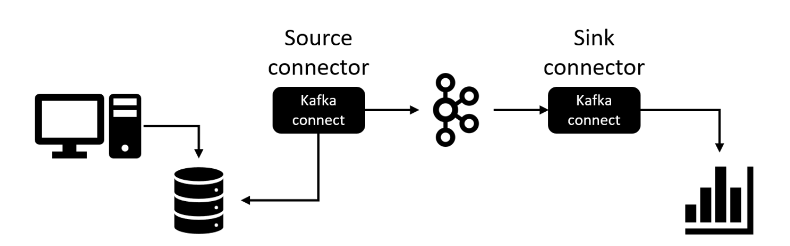

npx prisma migrate dev --name init

# Apache Kafka từ zero đến one

https://viblo.asia/p/001-message-driven-programming-voi-message-broker-va-apache-kafka-gDVK2OE0ZLj

### Install multiple Kafka

https://codersee.com/how-to-deploy-multiple-kafka-brokers-with-docker-compose/

## 001: Message-driven programming với Message broker và Apache Kafka

- Asynchronous programming:
- Message-driven programming (điều khiển tin nhắn): server và client ko giao
  tiếp trực tiếp với nhau, tất cả các request sẽ được gửi dưới dạng cho bên
  thứ 3. bên thứ 3 có nhiệm vụ điều hướng message đến địa chỉ cụ thể đảm bảo:
  gửi message thành công, gửi đúng địa chỉ.
- Message broker (môi giới): trung chuyển message từ người gửi đến người nhận:

  - Ưu điểm:
    1. Giảm tải cho server bằng việc giảm tải các tương tác trực tiếp.
    2. Lưu trữ request, trong trường hợp server gặp sự cố.
    3. Phân phối request đến server trong các bài toán cụ thể.
    4. Đơn giản hóa quá trình gửi message trong môi trường multi-services.
  - No silver bullet
    1. đảm bảo gửi nhận message đến đích.
    2. cần monitor thêm cả hệ thống message broker.
    3. xử lý vấn đề message broker lỗi.
    4. giảm latency, tăng performance .
  - Một số Message broker:
    - Apache ActiveMQ
    - Apache RockerMQ
    - RabbitMQ
    - Apache Kafka
    - IronMQ
    - ZeroMQ
    - Redis, thực tế hiếm khi sử dụng. Chẳng ai đi KIA Morning trên cao tốc
      trong khi đã có Lamborghini
  - Message distribution patterns:
    - Point-to-point messaging (queue).
    - Broadcast messaging (topic): một message có thể được gửi tới nhiều địa chỉ
      khác nhau.
  - Mô hình message broker:

    1. Producer/Publisher: nơi gửi
    2. Message broker: hệ thống điều hướng message.
    3. Consumer/Subscriber: nơi nhận message.

    

## 002: Apache Kafka topic, partition, offset và broker

Kafka là event streaming platform hơn hả message broker Số lượng broker trong
kafka cluster thường là số lẻ.

- thành phần:

  - Topic
  - Partition
  - Offset
  - Broker

- Apache Kafka:

  - High scalable: có khả năng mở rộng nhanh và dễ dàng, zero downtime. Thêm bớt
    broker vẫn hoạt động bình thường.

  - High durable: message lưu trên disk, nếu 1 broker die thì hệ thống vẫn hoạt
    động bình thường.

  - High reliable.
  - High performance.

## 003: Gửi và nhận message trong Apache Kafka

Mỗi khi thêm một feature mới có 2 cách để team quyết định:

- Tất cả cùng vote (mất thời gian)
- Bầu ra 1 leader để quyết định cho cả team
- Tại 1 thời điểm mỗi partition có duy nhất 1 leader
- Chỉ có read/ write message từ replication leader
- Các replication còn lại được gọi là ISR: (in sync replica)

### Producer

producer là người gửi message đến message broker, write data đến partition của
topic

### ack - acknowledgment

- acks=0: giống fire-and-forget, gửi message mà không chờ phản hồi. Do vậy có
  thể dẫn đến tình huống mất message.

- acks=1: default setting. Lần này chắc chắn hơn, producer chờ cho tới khi nhận
  được phản hồi từ replication leader. Tuy nhiên chưa ngăn chặn hoàn toàn việc
  mất message. Replication leader write message thành công, báo lại cho
  producer, tuy nhiên broker có thể gặp sự cố với disk, không thể khôi phục
  data.

- acks=all: lần này thì quá chắc chắn, đảm bảo không mất message. Producer sẽ
  nhận được phản hồi khi tất cả replication leader và IRS write data thành công.

> Từ 1 partition/1 consumer thành 5 partition/5 consumer khả năng sẽ đem lại
> performance tốt

## 004: Apache Kafka consumer offset, Broker discovery và Zookeeper

offset: vị trí lưu message trong partition

consumer offset: giống như checkpoint hoặc bookmark for customer group. Consumer
cần biết chính xác vị trí của message cần đọc.

1.1. At most once

Consumer commit offset ngay khi nhận được message. (gặp sự cố ngay kho vừa gặp
message mà chưa kịp xử lý).

1.2. At least once

Consumer commit offset sau khi xử lý xong message. Nếu consumer gặp sự cố sau
khi wake up consumer sẽ xử lý lại vấn đề đó.

Idempotent: là những xử lý có thể lặp lại nhiều lần mà không ảnh hưởng đến hệ
thống

Ví dụ: RESTful API quey resource GET method là idempotent API

1.3. Exactly once

### 005: Bao nhiêu partition là đủ cho một topic trong Apache Kafka

Kafka không cho phép giảm số lượng partition của topic, chỉ cho phép tăng hoặc
xóa đi tạo lại

### 006: Thực hành Apache Kafka với Kafka CLI

### 007: Simple Kafka Producer client API với Java

### 008: Kafka Producer transaction và delivery semantics với Java

### 009: Kafka Consumer client API với Java

### 010: Apache Kafka connect concept

