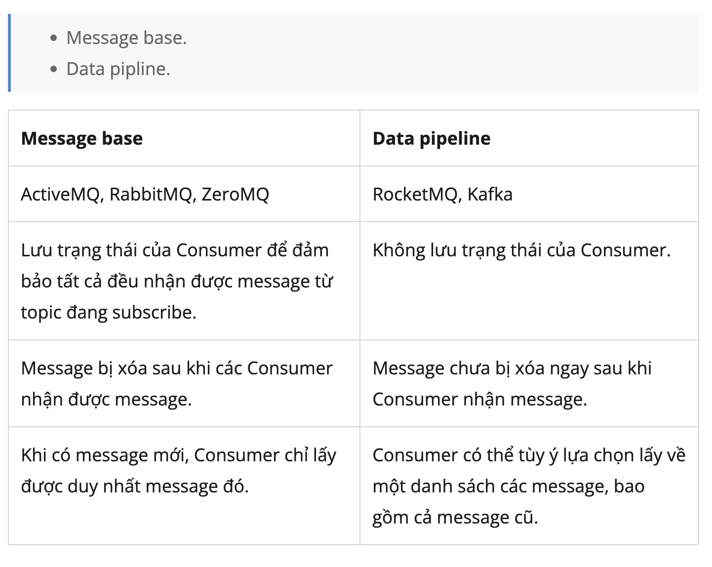

npx prisma migrate dev --name init

# Apache Kafka từ zero đến one

https://viblo.asia/p/001-message-driven-programming-voi-message-broker-va-apache-kafka-gDVK2OE0ZLj

### Install multiple Kafka

https://codersee.com/how-to-deploy-multiple-kafka-brokers-with-docker-compose/

## 001: Message-driven programming với Message broker và Apache Kafka

- Asynchronous programming:
- Message-driven programming (điều khiển tin nhắn): server và client ko giao
  tiếp trực tiếp với nhau, tất cả các request sẽ được gửi dưới dạng cho bên
  thứ 3. bên thứ 3 có nhiệm vụ điều hướng message đến địa chỉ cụ thể đảm bảo:
  gửi message thành công, gửi đúng địa chỉ.
- Message broker (môi giới): trung chuyển message từ người gửi đến người nhận:

  - Ưu điểm:
    1. Giảm tải cho server bằng việc giảm tải các tương tác trực tiếp.
    2. Lưu trữ request, trong trường hợp server gặp sự cố.
    3. Phân phối request đến server trong các bài toán cụ thể.
    4. Đơn giản hóa quá trình gửi message trong môi trường multi-services.
  - No silver bullet
    1. đảm bảo gửi nhận message đến đích.
    2. cần monitor thêm cả hệ thống message broker.
    3. xử lý vấn đề message broker lỗi.
    4. giảm latency, tăng performance .
  - Một số Message broker:
    - Apache ActiveMQ
    - Apache RockerMQ
    - RabbitMQ
    - Apache Kafka
    - IronMQ
    - ZeroMQ
    - Redis, thực tế hiếm khi sử dụng. Chẳng ai đi KIA Morning trên cao tốc
      trong khi đã có Lamborghini
  - Message distribution patterns:
    - Point-to-point messaging (queue).
    - Broadcast messaging (topic): một message có thể được gửi tới nhiều địa chỉ
      khác nhau.
  - Mô hình message broker:

    1. Producer/Publisher: nơi gửi
    2. Message broker: hệ thống điều hướng message.
    3. Consumer/Subscriber: nơi nhận message.

    

## 002: Apache Kafka topic, partition, offset và broker

Kafka là event streaming platform hơn hả message broker Số lượng broker trong
kafka cluster thường là số lẻ.

- thành phần:

  - Topic
  - Partition
  - Offset
  - Broker

- Apache Kafka:

  - High scalable: có khả năng mở rộng nhanh và dễ dàng, zero downtime. Thêm bớt
    broker vẫn hoạt động bình thường.

  - High durable: message lưu trên disk, nếu 1 broker die thì hệ thống vẫn hoạt
    động bình thường.

  - High reliable.
  - High performance.
